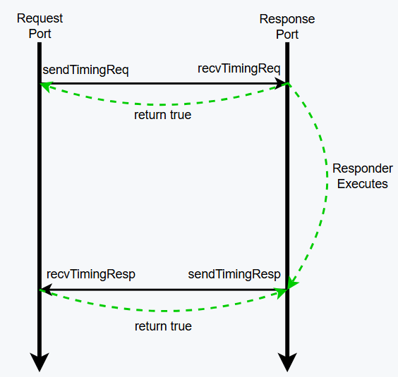
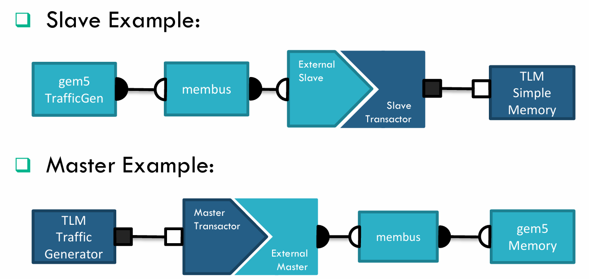
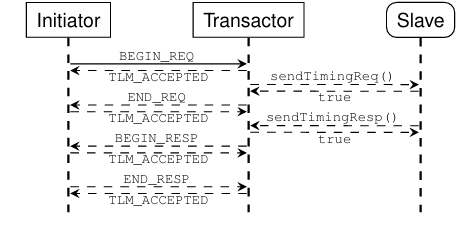

---
# try also 'default' to start simple
theme: seriph
# random image from a curated Unsplash collection by Anthony
# like them? see https://unsplash.com/collections/94734566/slidev
background: https://cover.sli.dev
# some information about your slides (markdown enabled)
title: Welcome to Slidev
info: |
  ## Slidev Starter Template
  Presentation slides for developers.

  Learn more at [Sli.dev](https://sli.dev)
# apply UnoCSS classes to the current slide
class: text-center
# https://sli.dev/features/drawing
drawings:
  persist: false
# slide transition: https://sli.dev/guide/animations.html#slide-transitions
transition: slide-left
# enable MDC Syntax: https://sli.dev/features/mdc
mdc: true
# duration of the presentation
duration: 35min
---

# Gem5 with SystemC

<div @click="$slidev.nav.next" class="mt-12 py-1" hover:bg="white op-10">
  Press Space for next page <carbon:arrow-right />
</div>

<div class="abs-br m-6 text-xl">
  <button @click="$slidev.nav.openInEditor()" title="Open in Editor" class="slidev-icon-btn">
    <carbon:edit />
  </button>
  <a href="https://github.com/slidevjs/slidev" target="_blank" class="slidev-icon-btn">
    <carbon:logo-github />
  </a>
</div>

<!--
The last comment block of each slide will be treated as slide notes. It will be visible and editable in Presenter Mode along with the slide. [Read more in the docs](https://sli.dev/guide/syntax.html#notes)
-->

---
transition: fade-out
---

# 背景介绍

Gem5提供了高精度、灵活可配置的CPU仿真模型。我们的仿真器则使用SystemC TLM编写，能否将二者结合？

- 目的：使用Gem5配置CPU模型，接入到仿真器中替换原有的SystemC CPU模型，并且保证与其他未替换的SC模块正确交互
- 可行性：Gem5和SystemC都是C++写的，gem5 可以被构建为一个 C++ 库并嵌入到 SystemC 仿真环境中运行
- 难点：Gem5 模块间通信机制与 SystemC TLM2.0 不同，如何转换（Gem5 -> TLM，TLM -> Gem5）
  - 还需关注 Gem5 与 TLM2.0 计时方式是否有区别，如何同步时间

{width=400 style="display:block; margin:auto;"}


<!--
Here is another comment.
-->
---
layout: two-cols
layoutClass: gap-16
---

# Table of contents

<Toc text-sm minDepth="1" maxDepth="2" />

---
transition: fade-out
level: 2
---

# Gem5 通信简介
Gem5有两种类型的Ports：`RequestPort` and `ResponsePort`
- `RequestPorts` make `requests` and await `responses`.
- `ResponsePorts` await `requests` and send `responses`
```c++
class RequestPort {
  ...
  public:
    bool sendTimingReq(PacketPtr pkt);
    // inherited from TimingRequestProtocol in `src/mem/protocol/timing.hh`
    virtual bool recvTimingResp(PacketPtr pkt) = 0;
    virtual void sendRetryResp();
   ...
};

class ResponsePort {
  ...
  public:
    bool sendTimingResp(PacketPtr pkt);
    // inherited from TimingResponseProtocol in `src/mem/protocol/timing.hh`
    virtual bool recvTimingReq(PacketPtr pkt) = 0;
    virtual void sendRetryReq();
   ...
};
```
---
transition: fade-out
level: 2
class: px-20
---

# Gem5通信
分为 normal 和需要 retry 的情况
<!-- <div grid="~ cols-2 gap-2" m="t-2">




</div> -->
{width=550 style="display:block; margin:auto;"}

---
transition: fade-out
level: 2
---

# TLM2.0通信简介
TLM2.0中，一次“事务”被抽象为一个socket，“事务”的发起者为initiator，“事务”的响应方为target，initiator socket和target socket之间完成信息交互。

4 种 transport 接口：
1. **Blocking**：loosely-timed，通过单次函数调用实现完整事务，仅模拟事务开始和结束时的时间点。阻塞接口虽能快速执行事务，但其时间精度有限
2. **Non-blocking**：approximately-timed，模拟单次transaction过程中initiator和target的一系列交互。4个阶段
3. **Debug**：与blocking传输类似，但是不考虑时间因素且无任何副作用。适用于仿真过程中的初始化与调试操作
4. **Direct memory interface（DMI）**：一般用于功能建模，target把memory的指针传给initiator，不用transaction。没有timing

---
layout: image-right
image: ./images/TLM-nb.png
backgroundSize: 35em 80%
transition: fade-out
level: 2
---

# TLM2.0 通信简介

- 分类
   - 阻塞：只需在 target 中注册`b_transport`
   - 非阻塞：
       - 在 initiator 中为 initiator socket 注册 `nb_transport_bw`
       - 在 target 中为 target socket 注册 `nb_transport_fw`
       - 引入四个phase标识传输的中间状态：BEGIN_REQ，END_REQ，BEGIN_RESP，END_RESP


---
transition: fade-out
level: 2
class: px-20
---

# COMBINING GEM5 AND TLM
Gem5与TLM在通信上有很多相似之处

- 通信方式
{width=400 style="display:block; margin:auto;"}

- 传输包所含信息
{width=400 style="display:block; margin:auto;"}

---
transition: fade-out
level: 2
---

# Gem5 with SystemC overview
master and slave example

{width=700 style="display:block; margin:auto;"}

---
transition: fade-out
level: 2
---

#  COMBINING GEM5 AND TLM

不同之处在于gem5发送失败时会有retry机制，而TLM发送时会有排他性（exclusion rules）的动作

**gem5 retry机制**
- 如果 master 或者 slave 任一方在忙，此时的 req 或者 resp 会被搁置，等待忙的那一方闲下来，会发送一个 retry，告诉另一方你可以重新发送 req 或者 resp了

**TLM2.0 exclusion rule**
-  request exclusion rules: initiator 不能发出下一个 BEGIN_REQ，除非满足如下条件
   - 已经从下游组件收到了紧邻的前一个事务的 END_REQ 或 BEGIN_RESP
   - 下游组件已经通过从 nb_transport_fw 调用中返回 TLM_COMPLETED 值，完成了前一个事务
- response exclusion rule：target 不能发出下一个 BEGIN_RESP，除非满足如下条件
   - 已经从上游组件收到了紧邻的前一个事务的 END_RESP
   - 某个组件已经通过返回 TLM_COMPLETED，完成了前一个事务

---
transition: fade-out
level: 2
---

#  COMBINING GEM5 AND TLM
需要结合二者的机制来同时满足 retry 和 exclusion rules，规则复杂但是实现还是比较简单
- 从 gem5 到 SystemC：当 TLM 方忙时，如何让 gem5 停下来并在 TLM 空闲时自动重试？
  - 忙拒绝：gem5会通过req函数的返回值判断是否成功发出请求，TLM方忙的时候给出一个标志，当这个标志为真时return false即可，在实现中，当TLM处于BEGIN_REQ时会有一个blockingRequest
  - 空闲时重试：TLM进入END_REQ阶段时会解除阻塞然后检查是否有被拒绝的请求，如果有则发起gem5::sendRetryReq
- 从 SystemC 到 gem5：当 gem5 忙时，如何利用 gem5 的规则卡住 SystemC 发起方？
  - 利用 gem5的忙拒绝机制，TLM 调用 sendTimingReq 如果为 false 则卡住，然后标记需要retry，由于TLM exclusion机制，此时会卡在这里，也不会有下一个BEGIN_REQ发过来
  - gem5空闲时（上一个请求进入END_REQ时）会唤醒systemc，通过sendReqRetry调用到 recvReqRetry，这个函数内部会唤醒那个pending的req，重新发送BEGIN_REQ，此时

---
transition: fade-out
level: 2
---
## TLM为master，Gem5为slave
<div grid="~ cols-2 gap-2" m="t-2">

{width=400 style="display:block; margin:auto;"}

{width=400 style="display:block; margin:auto;"}

</div>


---
transition: fade-out
level: 2
---

## Gem5为master，TLM为slave

<div grid="~ cols-2 gap-2" m="t-2">

{width=400 style="display:block; margin:auto;"}

{width=400 style="display:block; margin:auto;"}

</div>


---
transition: fade-out
level: 2
---
## 如何将TLM接入gem5，gem5为主控
## 如何将gem5接入TLM，TLM为主控
packet转换
```c++
tlm::tlm_generic_payload * packet2payload(PacketPtr packet)
std::pair<PacketPtr, bool> payload2packet(RequestorID _id, tlm::tlm_generic_payload &trans)
```
TLM需要实现 gem5 的 ExternalPort interface，在函数内部调用TLM的fw或者bw实现转换
```c++
/** The gem5 Port slave interface */
gem5::Tick recvAtomic(gem5::PacketPtr packet);
void recvFunctional(gem5::PacketPtr packet);
bool recvTimingReq(gem5::PacketPtr packet);
bool recvTimingSnoopResp(gem5::PacketPtr packet);
void recvRespRetry();
void recvFunctionalSnoop(gem5::PacketPtr packet);
```
TLM还需要实现bw和fw的逻辑
- gem5->tlm：需要实现fw，bw在bridge已经实现
- tlm->gem5：需要实现bw，fw在brdige已经实现

---
transition: fade-out
level: 2
---
## gem5 与 TLM 计时方式的统一

时间上的差异
- TLM是先执行事件，然后加上一个delay同步时间。但是gem5是需要一个预估时间，然后插入到事件调度队列，等待时间到了之后才触发该事件
- TLM 是“先斩后奏”（先做完逻辑，再追加时间），而 gem5 是“按部就班”（严格按照时间表触发逻辑）。

举个例子：
- 比如说TLM实现了访存，在gem5这边不能像TLM一样只是单纯的把delay加上去，他必须插入一个事件，然后当全局时钟到了指定Tick之后才能触发该事件
- 也就是对于gem5来说，他不知道TLM的存在，他只知道自己发起请求，然后插入一个访存事件，有多少延迟，等待访存事件触发（完成）之后调用 resp，这样就完成了一次完整的读写事务

---
transition: fade-out
level: 2
---
## gem5 与 TLM 计时方式的统一
总结：
- 时钟实际还是以gem5为主，TLM那边只是记录一次事务的延迟，然后作为一个事件插入到gem5中，使其时间前进
- 一次交互（req或者resp握手一次）： curTick + gem5延时 + TLM延时

  - gem5 → TLM 方向：延迟存在 packet->headerDelay 中
  - TLM → gem5 方向：延迟通过 nb_transport_bw 的 delay 参数返回
  - gem5 事件调度：PayloadEvent::notify 将 delay 转换为 gem5::Tick，然后调用 port.owner.schedule(this, nextEventTick) 在 gem5 中插入事件

---
transition: fade-out
level: 2
class: px-0
---

<div grid="~ cols-2 gap-2" m="t-2">
```
  时间轴 (gem5 Tick)
      |
      |  gem5 CPU 发起请求
      |  packet->headerDelay = 1000 (gem5 ticks)
      |
  1000 ────────────────────────────────────────────────────
      |  SCSlavePort::recvTimingReq
      |  delay = sc_time::from_value(1000)  // 转换为 SystemC 时间
      |
      |  nb_transport_fw(*trans, BEGIN_REQ, delay)
      |
      |  Target::nb_transport_fw
      |  m_peq.notify(trans, BEGIN_REQ, delay)
      |
      |  [SystemC 时间推进到 1000 ps]
      |
      |  Target::peq_cb(BEGIN_REQ)
      |  send_end_req()
      |
      |  nb_transport_bw(trans, END_REQ, delay=10ns)  ← TLM 返回延迟
      |
      |  SCSlavePort::nb_transport_bw
      |  pe->notify(trans, END_REQ, 10ns)
      |
      |  PayloadEvent::notify:
      |    nextEventTick = sc_time_stamp().value() + 10ns
      |                  = 1000 + 10000 = 11000
      |    
      |
```

```
            port.owner.schedule(this, 11000)  ← 在 gem5 中调度事件
  11000 ───────────────────────────────────────────────────
      |  [gem5 时间推进到 11000]
      |
      |  PayloadEvent::process()
      |  SCSlavePort::pec(END_REQ)
      |
      |  [等待 Target 执行事务...]
      |
      |  Target::send_response(BEGIN_RESP, delay=10ns)
      |
      |  SCSlavePort::nb_transport_bw
      |  pe->notify(trans, BEGIN_RESP, 10ns)
      |
      |  PayloadEvent::notify:
      |    nextEventTick = 11000 + 10000 = 21000
      |    port.owner.schedule(this, 21000)
      |
  21000 ───────────────────────────────────────────────────
      |  [gem5 时间推进到 21000]
      |
      |  PayloadEvent::process()
      |  SCSlavePort::pec(BEGIN_RESP)
      |  sendTimingResp(packet)  ← 响应返回 gem5 CPU
      |

```

</div>


---
layout: center
class: text-center
---

# Learn More

[Documentation](https://sli.dev) · [GitHub](https://github.com/slidevjs/slidev) · [Showcases](https://sli.dev/resources/showcases)

<PoweredBySlidev mt-10 />
